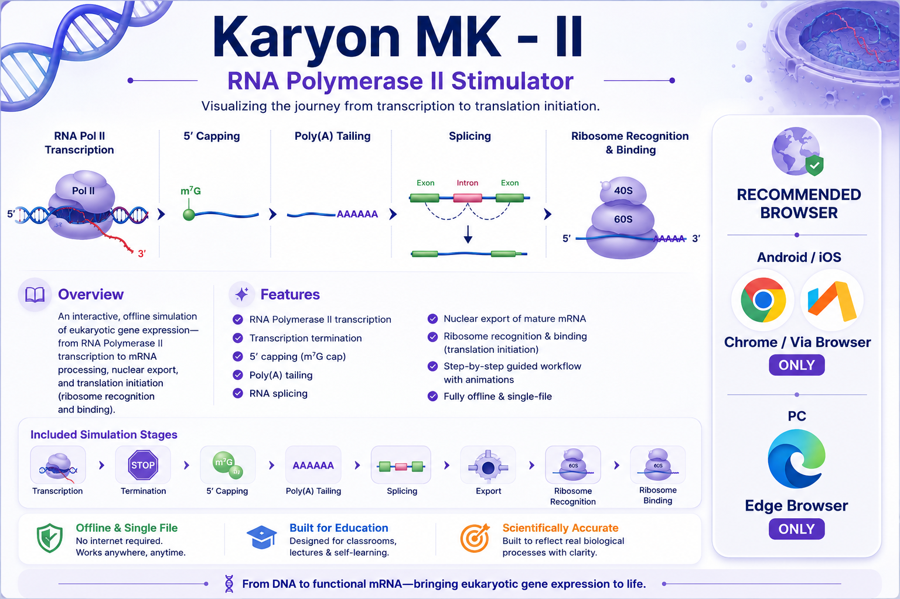

  

# 🧬 Karyon MK - II

### RNA Polymerase II Simulator

Interactive, browser-based educational simulation of eukaryotic gene expression—from RNA Polymerase II transcription through mRNA processing, nuclear export, and ribosome recognition for translation initiation.

---

## 📖 Overview

**Karyon MK - II** is a scientifically accurate, single-file HTML simulation designed for classrooms, lectures, and self-learning. It visualizes the early stages of eukaryotic gene expression through guided animations and runs completely offline—no installation or internet connection required.

---

## ✨ Features

- 🔹 RNA Polymerase II transcription
- 🔹 Transcription termination
- 🔹 5′ mRNA capping (m⁷G cap)
- 🔹 Poly(A) tail addition
- 🔹 RNA splicing
- 🔹 Nuclear export
- 🔹 Ribosome recognition & binding
- 🔹 Interactive guided workflow
- 🔹 Fully offline

---

## 📦 Simulation Workflow

RNA Polymerase II Transcription → Termination → 5′ Capping → Poly(A) Tailing → RNA Splicing → Nuclear Export → Ribosome Recognition & Binding

---

## 🖥️ Recommended Browsers

> **📱 Android / iOS:** **Via Browser** or **Google Chrome** *(Recommended)*

> **💻 PC:** **Microsoft Edge** *(Recommended)*

The simulator runs entirely offline once downloaded.

---

## 📜 License

GNU General Public License v3.0 (GPL-3.0)

---

## 👨‍🏫 Author

**Draven-Ashcroft**

**DIPS Chain of Institutions, Tanda**

---

## 🙏 Acknowledgements

Developed with assistance from modern AI tools.

Special thanks to:

- **OpenAI (ChatGPT)** — scientific review, debugging, and implementation
- **Anthropic Claude** — implementation assistance and optimization
- **Google Gemini** — concept exploration and refinement

Inspired by **BioRender**, **Nature Reviews**, **NCERT Biology**, and modern scientific visualization principles.

---

### *"From transcription to translation initiation — bringing eukaryotic gene expression to life."*

